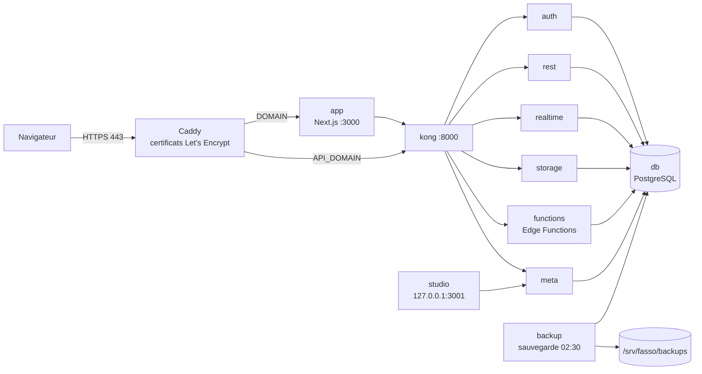

# GFB-STOCK - Guide de déploiement sur un VPS Ubuntu

Public : le propriétaire de l'application (pas besoin d'être expert Docker).
Toutes les commandes ci-dessous existent dans les fichiers du dossier `deploy/`.
Sauf mention contraire, on les lance **depuis la racine du dépôt** (`~/facture-fasso`), en tant qu'utilisateur `fasso`.

> Le dossier `deploy/` sert à la **production**. Le `compose.yaml` et le `Dockerfile.dev` de la racine servent uniquement au **développement local** (voir `docs/docker-local.md`) : ne pas les utiliser sur le VPS.

## 1. Architecture



- Seul **Caddy** est ouvert sur Internet (ports 80 et 443). Il obtient et renouvelle seul les certificats HTTPS.
- `DOMAIN` (ex. `app.mondomaine.sn`) = l'application. `API_DOMAIN` (ex. `api.mondomaine.sn`) = l'API Supabase utilisée par le navigateur.
- **Studio** (interface d'administration de la base) n'écoute que sur `127.0.0.1` : on y accède par tunnel SSH (section 9).
- Les données vivent sur le disque du VPS dans `/srv/fasso/data` (base : `db`, fichiers : `storage`) ; les sauvegardes dans `/srv/fasso/backups`.

## 2. Prérequis

- Un VPS **Ubuntu 22.04 ou 24.04**, **2 Go de RAM minimum** (un swap de 2 Go est créé par le script), accès `root` en SSH **par clé**.
- **Deux noms DNS** (enregistrements A/AAAA) pointant vers l'IP du VPS, créés **avant** le premier démarrage : `DOMAIN` et `API_DOMAIN`.
- Un compte e-mail transactionnel : **Resend** (clé API) et/ou un serveur **SMTP**. Il sert à :
  - la réinitialisation de mot de passe (variables `SMTP_*`) ;
  - l'envoi des factures par e-mail (variables `RESEND_API_KEY`, `EMAIL_EXPEDITEUR`, `EMAIL_REPONSE_A`).
- Une adresse `ACME_EMAIL` (avis d'expiration Let's Encrypt).

## 3. Premier déploiement, pas à pas

1. **Préparer le serveur** (en `root`, une seule fois). Après avoir récupéré le dépôt (ou copié le script) :
   ```bash
   sudo bash deploy/scripts/bootstrap-vps.sh
   ```
   Le script (relançable sans danger) : met à jour Ubuntu, installe Docker, crée l'utilisateur `fasso` (autre nom possible : `sudo bash bootstrap-vps.sh monnom`), ouvre le pare-feu sur le port SSH réel (lu via `sshd -T`), 80 et 443, crée le swap, `fail2ban` et les dossiers `/srv/fasso/...` (`/srv/fasso` en 711 ; `data/storage`, `data/caddy`, `data/deno-cache` et `backups` en 700 ; `data/db` reste à l'uid postgres). Les clés SSH de root sont copiées vers `fasso` **sans** les lignes `command=`.

   **Durcissement SSH** : uniquement si une clé SSH valide est installée pour `fasso`. Le script écrit `/etc/ssh/sshd_config.d/00-fasso.conf` (premier fichier lu), vérifie avec `sshd -T` que `passwordauthentication` et `permitrootlogin` valent bien `no` (sinon il annule et échoue), puis recharge sshd. **Gardez votre session ouverte** et testez `ssh fasso@<ip>` dans un autre terminal avant de la fermer.
2. **Récupérer le code** (utilisateur `fasso`) :
   ```bash
   git clone <url-du-depot> ~/facture-fasso && cd ~/facture-fasso
   ```
3. **Générer les secrets** :
   ```bash
   ./deploy/scripts/gen-secrets.sh
   ```
   Crée `deploy/.env` (droits 600) avec mot de passe base, clés JWT, etc. Les secrets ne sont jamais affichés. Le script refuse d'écraser un `.env` existant (`--force` les remplacerait : anciennes clés **perdues**).
4. **Remplir `deploy/.env`** : `nano deploy/.env`. À renseigner à la main :

   | Variable | À mettre |
   |---|---|
   | `DOMAIN`, `API_DOMAIN` | vos deux noms DNS (pas `exemple.sn` : `deploy.sh` refuse) |
   | `ACME_EMAIL` | votre e-mail |
   | `SMTP_HOST`, `SMTP_PORT`, `SMTP_USER`, `SMTP_PASS`, `SMTP_ADMIN_EMAIL`, `SMTP_SENDER_NAME` | exemple Resend en SMTP : `smtp.resend.com`, port 465, user `resend`, pass = clé API |
   | `RESEND_API_KEY`, `EMAIL_EXPEDITEUR`, `EMAIL_REPONSE_A` | envoi des factures par e-mail |
   | `MAILER_AUTOCONFIRM` | laisser `false` (`deploy.sh` refuse `true` en production) |

   Les autres valeurs (`DATA_DIR`, `JWT_EXPIRY`, `STUDIO_PORT`, durées des URL signées, `APP_TAG`) ont des valeurs par défaut correctes.
5. **Sauvegarder `deploy/.env` hors du VPS** (gestionnaire de mots de passe). Sans `JWT_SECRET` et `POSTGRES_PASSWORD`, les données sauvegardées sont inexploitables.
6. **Déployer** :
   ```bash
   ./deploy/scripts/deploy.sh
   ```
   Le script : vérifie le `.env` (lu ligne par ligne, **jamais exécuté** : une valeur contenant `$`, un accent grave, `;` ou des espaces doit être entre guillemets, voir l'en-tête de `.env.example` ; `MAILER_AUTOCONFIRM=true` est refusé), construit l'image de l'application (plusieurs minutes), démarre la base (au tout premier démarrage, `db-init/98-realtime.sql` crée le schéma Realtime et `db-init/99-roles.sql` donne leur mot de passe aux rôles de service Supabase : sans lui, auth/rest/storage échouent en `password authentication failed`), **démarre Storage avant les migrations** (le schéma `storage` est créé par Storage au premier démarrage et la migration 0001 en dépend), fait une sauvegarde, applique les migrations et le seed, enregistre les secrets des tâches planifiées (Vault, transmis par l'entrée standard), démarre tout, puis attend que chaque service soit sain, vérifie qu'aucun port n'est publié hors 80/443 (Studio : 127.0.0.1 uniquement), teste `https://DOMAIN` et `https://API_DOMAIN`, et seulement alors conserve l'ancienne image comme `fasso-app:previous` (rollback). Au premier lancement, un `AVERTISSEMENT ... injoignable` peut apparaître si le certificat n'est pas encore émis : patientez une minute et vérifiez (section 4).
7. **Créer le premier compte admin** : `fasso create-admin` (section 5). `deploy.sh` a déjà lancé le test de fumée (section 13) et installé la commande `fasso`.

## 4. Vérifications après déploiement

```bash
./deploy/scripts/deploy.sh status      # ou, plus complet : fasso status
```
Tous les services doivent être `running` / `healthy` (`db`, `auth`, `storage`, `realtime`, `kong`, `meta`, `app`, `caddy`...). Puis :

- Ouvrir `https://<DOMAIN>` : la page de connexion s'affiche, cadenas HTTPS valide.
- Tester l'API : `curl -H "apikey: <ANON_KEY>" https://<API_DOMAIN>/auth/v1/health` (c'est le test que fait `deploy.sh`).
- Vérifier que le service de sauvegarde existe : `./deploy/scripts/deploy.sh status` doit lister `backup`. S'il manque, `deploy.sh` affiche « service de sauvegarde absent » : à corriger avant la mise en service.
- Le catalogue de démarrage (catégories, 6 produits, 4 entrepôts : Siège, Notto, Dakar, Keur Massar) et les infos entreprise viennent de `supabase/seed.sql` ; ils sont modifiables ensuite dans l'application. Le crédit client reste désactivé (`seuil_credit_max` = 0) tant que l'admin ne le configure pas dans Paramètres.

## 5. Créer le premier compte admin

L'inscription libre est **désactivée** en production (`GOTRUE_DISABLE_SIGNUP`) et le seed ne livre aucun compte admin. Une seule commande crée le premier administrateur :

```bash
fasso create-admin          # ou : ./deploy/scripts/create-admin.sh
```

Elle pose trois questions (e-mail, nom affiché, mot de passe saisi **masqué** ; en appuyant sur Entrée sans rien saisir, un mot de passe de 20 caractères est **généré et affiché une seule fois** : notez-le tout de suite). Ensuite l'admin crée tous les autres comptes (agents, autres admins) depuis l'application, écran **Utilisateurs**.

Ce que fait le script, pour information :
- il crée le compte via l'API d'administration de l'authentification, appelée **depuis le conteneur `app`** (réseau interne ; la route `/auth/v1/admin` reste fermée depuis Internet). Le mot de passe et la clé `service_role` ne passent jamais en argument de commande (invisibles dans `ps`) ;
- il passe le profil `public.utilisateurs` au rôle `admin`, dans une transaction unique. (L'ancienne méthode « Studio + `UPDATE ... SET role = 'admin'` » **ne fonctionne plus** : le trigger `trg_empecher_auto_promotion` refuse tout changement de rôle tant qu'aucun admin n'est connecté. Le script le désactive le temps de la transaction et le réactive avant de valider ; le changement est tracé dans le journal d'audit) ;
- il vérifie l'e-mail (format) et la longueur du mot de passe (12 caractères minimum) ;
- il est **idempotent** : relancé avec un e-mail déjà administrateur, il ne change rien ; relancé après une interruption, il termine la promotion ;
- il **refuse** s'il existe déjà un admin actif (il faudrait alors créer les comptes depuis l'application), sauf option `--force`.

Options : `--email`, `--nom`, `--generate` (mot de passe généré), `--force`. Puis ouvrir `https://<DOMAIN>` et se connecter.

## 6. Mettre à jour et revenir en arrière

**Mise à jour** (récupère le code, reconstruit, sauvegarde, migre, redémarre) :
```bash
./deploy/scripts/deploy.sh update
```
Le script fait un `git pull --ff-only` : il échoue si le dépôt du VPS a des modifications locales. Une sauvegarde est faite avant la migration (`SKIP_BACKUP=1` pour l'ignorer, déconseillé).

**Rollback de l'application** (image précédente, `fasso-app:previous`) :
```bash
./deploy/scripts/deploy.sh rollback
```
Attention : les migrations SQL ne sont **pas** annulées (elles sont additives). Si la base elle-même pose problème, restaurez une sauvegarde (section 7). Pour revenir aussi au code : `git checkout <commit>`.

Autres commandes : `./deploy/scripts/deploy.sh logs [service]` (suivre les logs), `./deploy/scripts/deploy.sh status`.

## 7. Sauvegarde et restauration

Le service `backup` fait une sauvegarde **chaque jour à 02:30** (fuseau `Africa/Dakar`) dans `/srv/fasso/backups/daily/<AAAAMMJJ_HHMMSS>/` : `db.dump` (toute la base), `storage.tar.gz` (photos, logo, PDF), `roles.sql`, `SHA256SUMS`. Rotation : 7 quotidiennes, 4 hebdomadaires, 6 mensuelles. Réglages optionnels dans `deploy/.env` (présents, commentés, dans `.env.example`) : `BACKUP_HOUR`, `TZ`, `KEEP_DAILY`, `KEEP_WEEKLY`, `KEEP_MONTHLY`, `BACKUP_VERIFY_RESTORE`, `NOTIFY_WEBHOOK_URL`, `NOTIFY_NTFY_URL`, `HEALTHCHECK_URL`. Un échec envoie une notification si l'une de ces URL est définie.

Dans les commandes suivantes, on note `DC` = `docker compose -f deploy/compose.prod.yaml --env-file deploy/.env`.

**Sauvegarde immédiate** (identique à `deploy.sh`) : `DC run --rm --no-deps backup now`. Les sauvegardes sont créées en `umask 077` (illisibles par les autres comptes).

### Copie hors du VPS (indispensable)
Un disque qui tombe emporte données **et** sauvegardes. Deux options :
- **Automatique** (désactivée par défaut) : dans `deploy/.env`, mettre `OFFSITE_ENABLED=true`, `OFFSITE_REMOTE=offsite:`, `OFFSITE_RETENTION_DAYS` (60 par défaut), la configuration du stockage S3/B2/R2/Wasabi (`RCLONE_CONFIG_OFFRAW_TYPE`, `_PROVIDER`, `_ENDPOINT`, `_ACCESS_KEY_ID`, `_SECRET_ACCESS_KEY`, `_REGION`) **et le chiffrement, obligatoire** : `RCLONE_CONFIG_OFFSITE_TYPE=crypt`, `RCLONE_CONFIG_OFFSITE_REMOTE=offraw:bucket/gfb`, `RCLONE_CONFIG_OFFSITE_PASSWORD` (et `_PASSWORD2`), obscurcis avec `rclone obscure`. `backup.sh` refuse la copie hors site (et notifie l'échec) si ce chiffrement est absent. Conservez les mots de passe crypt hors du VPS : sans eux, les copies sont illisibles. Puis `DC up -d backup`. Détails : `deploy/backup/README.md`.
- **Manuelle** : copier régulièrement `/srv/fasso/backups` et `deploy/.env` vers votre ordinateur (ex. `scp`/`rsync`).

### Test de restauration (à faire chaque trimestre)
Sans risque : restaure dans une base temporaire, affiche des contrôles (tables, migrations, factures, produits, utilisateurs, policies), puis la supprime. La production n'est pas touchée.
```bash
ls /srv/fasso/backups/daily/
DC exec backup restore.sh --dump /backups/daily/<SET>/db.dump
```
Le test est réussi si la sortie se termine par `RESTAURATION VALIDEE`. Des erreurs « permission denied / already exists » sur les schémas internes Supabase (realtime, extensions) sont normales. Notez la date du test.

### Restauration réelle (sinistre)
Écrase la base actuelle. Sur un serveur neuf, refaire les étapes 1 à 6 de la section 3 avec le `.env` d'origine (même `JWT_SECRET` et `POSTGRES_PASSWORD`), puis :
```bash
DC stop app auth rest realtime storage meta kong functions
DC exec backup restore.sh --dump /backups/daily/<SET>/db.dump --in-place --yes
sudo tar -xzf /srv/fasso/backups/daily/<SET>/storage.tar.gz -C /srv/fasso/data/storage
./deploy/scripts/deploy.sh
```
(Les fichiers Storage se restaurent depuis l'hôte, car le service `backup` les voit en lecture seule. Le dernier `deploy.sh` redémarre tout et rattrape d'éventuelles migrations plus récentes.)

## 8. Variables d'environnement (deploy/.env)

| Groupe | Variables |
|---|---|
| Domaines | `DOMAIN`, `API_DOMAIN`, `ACME_EMAIL` |
| Données | `DATA_DIR` (défaut `/srv/fasso/data`) |
| Secrets générés | `POSTGRES_PASSWORD`, `JWT_SECRET`, `ANON_KEY`, `SERVICE_ROLE_KEY`, `SECRET_KEY_BASE`, `REALTIME_DB_ENC_KEY`, `CRON_SECRET`, `JWT_EXPIRY` |
| E-mail Auth (SMTP) | `SMTP_HOST`, `SMTP_PORT`, `SMTP_USER`, `SMTP_PASS`, `SMTP_ADMIN_EMAIL`, `SMTP_SENDER_NAME`, `MAILER_AUTOCONFIRM` |
| E-mail factures (Resend) | `RESEND_API_KEY`, `EMAIL_EXPEDITEUR`, `EMAIL_REPONSE_A` |
| Divers | `FACTURE_PDF_SIGNED_URL_TTL_SECONDS`, `BON_LIVRAISON_PDF_SIGNED_URL_TTL_SECONDS`, `EXPORT_RAPPORT_SIGNED_URL_TTL_SECONDS`, `STUDIO_PORT`, `APP_TAG` |

`DOMAIN`/`API_DOMAIN` et `ANON_KEY` sont **figés dans l'application au moment de la construction de l'image** : si vous les changez, relancez `./deploy/scripts/deploy.sh` (reconstruction).

## 9. Accéder à Studio (tunnel SSH)

Studio n'est jamais public. Depuis **votre ordinateur** :
```bash
ssh -L 3001:127.0.0.1:3001 fasso@<ip-du-vps>
```
puis ouvrir `http://localhost:3001` (le port est `STUDIO_PORT`, 3001 par défaut). Fermer la session SSH coupe l'accès. Ne jamais ajouter de `ports:` public dans le compose.

## 10. Supervision basique

| Besoin | Commande |
|---|---|
| État des services | `./deploy/scripts/deploy.sh status` |
| Logs en direct (tous / un service) | `./deploy/scripts/deploy.sh logs` / `./deploy/scripts/deploy.sh logs app` |
| Consommation CPU/mémoire | `docker stats` |
| Espace disque | `df -h /srv/fasso` et `du -sh /srv/fasso/data/* /srv/fasso/backups` |
| Dernières sauvegardes | `ls -lt /srv/fasso/backups/daily \| head` |

**Au quotidien, préférez `fasso status` / `fasso logs` (section 13).** Les logs Docker tournent automatiquement (3 fichiers de 10 Mo par service). Surveillez l'espace disque et la présence d'une sauvegarde de moins de 24 h. Évitez `docker compose down -v`.

## 11. Dépannage

| Symptôme | Cause probable / action |
|---|---|
| `deploy/.env absent` | Lancer `./deploy/scripts/gen-secrets.sh`. |
| `X est vide dans deploy/.env` | Compléter la variable citée (`DOMAIN`, `API_DOMAIN`, `ACME_EMAIL` et secrets obligatoires). |
| `DOMAIN/API_DOMAIN contiennent encore la valeur d'exemple` | Remplacer `exemple.sn` dans `.env`. |
| `/srv/fasso/data absent : lancer bootstrap-vps.sh` | Exécuter l'étape 1 (ou créer les dossiers). |
| `.env existe déjà` (gen-secrets) | Normal, protège vos clés. `--force` seulement sur une installation vide. |
| `https://... injoignable` / pas de certificat | DNS pas encore propagé vers l'IP, ou ports 80/443 bloqués. Vérifier le DNS puis `deploy.sh logs caddy`. |
| `<service> n'est pas sain après ...s` | `deploy.sh logs <service>` ; vérifier la RAM (`docker stats`, `free -h`). |
| `sauvegarde échouée` pendant un déploiement | Voir `deploy.sh logs backup` ; en dernier recours `SKIP_BACKUP=1 ./deploy/scripts/deploy.sh` (à éviter). |
| `git pull --ff-only` échoue | Le dépôt a des modifications locales : les annuler ou les commiter. |
| `Une migration est déjà en cours` / avertissement « checksum différent » | Ne jamais modifier une migration déjà appliquée : en créer une nouvelle. |
| Pas d'e-mail de réinitialisation | Vérifier `SMTP_*` et les logs `auth`. |
| Pas d'e-mail de facture | Vérifier `RESEND_API_KEY` et `EMAIL_EXPEDITEUR` (domaine validé chez Resend), logs `app`. |
| Impossible de se connecter par SSH après le bootstrap | Root et mot de passe sont désactivés : utiliser `ssh fasso@<ip>` avec votre clé. |

## 12. Écarts constatés dans les fichiers livrés

- `deploy/backup/README.md` et ce guide utilisent désormais la même commande de sauvegarde manuelle que `deploy.sh` (`run --rm --no-deps backup now`).
- `deploy/backup/README.md` et `compose.backup.yaml` écrivent en dur `/srv/fasso/...` : si vous changez `DATA_DIR`, adaptez aussi le fragment de sauvegarde.
- Le `HEALTHCHECK` du `Dockerfile` appelle `/api/health` (route existante) ; le compose de production teste `/`. Les deux fonctionnent.
- Le fragment hérité `deploy/db/compose.db.yaml` (inutilisé, remplacé par `compose.prod.yaml`) et `db-init/99-jwt.sql` (réglage `app.settings.jwt_secret` que rien ne lit) ont été supprimés.

## 13. Exploitation au quotidien

Après le premier déploiement, tout se pilote avec **une seule commande**, `fasso`, utilisable depuis n'importe quel dossier (lien `/usr/local/bin/fasso` posé par `bootstrap-vps.sh` ou, à défaut, par `deploy.sh` ; sinon `./deploy/scripts/fasso install`). `fasso help` affiche l'aide en français.

| Commande | Ce qu'elle fait |
|---|---|
| `fasso status` | Santé de chaque service, espace disque (alerte dès 80 %, rouge dès 90 %), **dernière sauvegarde et son âge** (rouge si elle a plus de 26 h), version du code. Code retour 1 s'il y a un problème. |
| `fasso logs [service]` | Suit les journaux (tous, ou `app`, `auth`, `db`, `caddy`, `backup`...). Ctrl+C pour quitter. |
| `fasso update` | `git pull`, reconstruction, sauvegarde, migrations (dont la 0024), redémarrage, puis test de fumée. |
| `fasso rollback` | Revient à l'image précédente de l'application (demande confirmation). La base n'est pas annulée. |
| `fasso backup` | Sauvegarde immédiate (base + fichiers). |
| `fasso backups` | Liste les sauvegardes quotidiennes, hebdomadaires, mensuelles (date, taille, âge). |
| `fasso restore` | Guide interactif. Par défaut : **test** de restauration dans une base temporaire, production intacte. `fasso restore --reelle` : restauration réelle, après avoir tapé `RESTAURER`, avec sauvegarde de sécurité préalable, arrêt des services, restauration base + fichiers puis redémarrage complet. |
| `fasso create-admin` | Crée le premier administrateur (section 5). |
| `fasso smoke` | Test de fumée (voir ci-dessous). |

(`deploy.sh status|logs|update|rollback` existent toujours et font la même chose.)

### Test de fumée (`fasso smoke`)
Lancé **automatiquement à la fin de `deploy.sh`** (`SKIP_SMOKE=1` pour l'ignorer ; un échec rend le code de sortie non nul). Chaque ligne est ✔ ou ✘ ; le code retour vaut 1 s'il y a au moins un ✘. Il contrôle :
- HTTPS de l'application et de l'API, et `/api/health` ;
- la connexion Auth **impossible sans identifiants** (400/401/422), PostgREST **fermé sans `apikey`** (401), un visiteur anonyme qui ne lit aucune facture, la route `/auth/v1/admin` fermée depuis Internet (403) ;
- les 5 buckets Storage (`factures`, `bons-livraison`, `rapports` privés ; `logo`, `produits-photos` publics) ;
- **toutes les migrations** de `supabase/migrations` enregistrées comme appliquées ;
- la présence et l'activation des triggers de la **migration 0024** ;
- un **test fonctionnel de cohérence facture / bon de livraison** : dans une transaction SQL **toujours annulée** (`ROLLBACK`), avec des données jetables, il vérifie que marquer un BL « livré, payé » crée le paiement et passe la facture en « payée », que repasser le BL « non payé » revient en arrière, et qu'une facture soldée par paiement manuel passe son BL en « payé ». Aucune donnée n'est conservée, et la numérotation des factures ne subit aucun trou (compteurs annulés avec la transaction). Pendant la fraction de seconde du test, la création simultanée d'une facture attendrait ; sans conséquence.

Hors VPS, `deploy/scripts/smoke-test.sh --sql-only` ne teste que la base.

### La migration 0024 est appliquée automatiquement
La migration `0024_coherence_facture_bon_livraison.sql` (le statut d'une facture et celui de son bon de livraison restent synchronisés) est appliquée par `deploy.sh` / `fasso update` comme toutes les autres : aucune action manuelle. Elle rattrape aussi les données existantes (un BL déjà « payé » dont la facture n'était pas soldée reçoit le paiement manquant). Le test de fumée confirme qu'elle est bien active.

### Alerte si la sauvegarde n'a pas tourné (optionnelle, non activée par défaut)
`fasso status --quiet` n'affiche rien quand tout va bien ; sinon il décrit les problèmes (service arrêté, disque à plus de 90 %, sauvegarde de plus de 26 h), envoie une notification via les mêmes variables que la sauvegarde (`NOTIFY_WEBHOOK_URL`, `NOTIFY_NTFY_URL` de `deploy/.env`) et sort en code 1. Pour l'activer, en tant que `fasso` : `crontab -e` puis ajouter

```
0 8 * * * /usr/local/bin/fasso status --quiet
```

(chaque matin à 8 h ; cron envoie aussi la sortie par e-mail locale si un MTA est installé). Pour retirer l'alerte : supprimer la ligne. Seuil modifiable : variable `FASSO_BACKUP_MAX_AGE_H` dans la ligne cron (`0 8 * * * FASSO_BACKUP_MAX_AGE_H=30 /usr/local/bin/fasso status --quiet`).

### Pour les agents et l'admin : ce que le déploiement garantit
- **Statuts cohérents** : une facture et son bon de livraison ne peuvent plus afficher des états contradictoires. Marquer un BL « livré, payé » enregistre le paiement et solde la facture ; l'inverse annule ce paiement ; une facture soldée par ailleurs met son BL à jour. La facture reste la référence pour l'argent. Le test de fumée le vérifie à chaque déploiement.
- **Sauvegardes quotidiennes** : chaque nuit à 02:30, base et fichiers (photos, logo, PDF), contrôlées, avec rotation 7 jours / 4 semaines / 6 mois. `fasso status` montre leur âge ; `fasso restore` permet de les essayer sans risque. Pensez à la copie hors du VPS (section 7).
- **Mises à jour sans perte** : `fasso update` sauvegarde avant de migrer, applique les évolutions de la base de façon additive (rien n'est supprimé), ne touche pas aux données, vérifie que tout fonctionne et conserve l'ancienne version pour un `fasso rollback` immédiat. Les agents peuvent rencontrer quelques secondes d'indisponibilité pendant le redémarrage.
